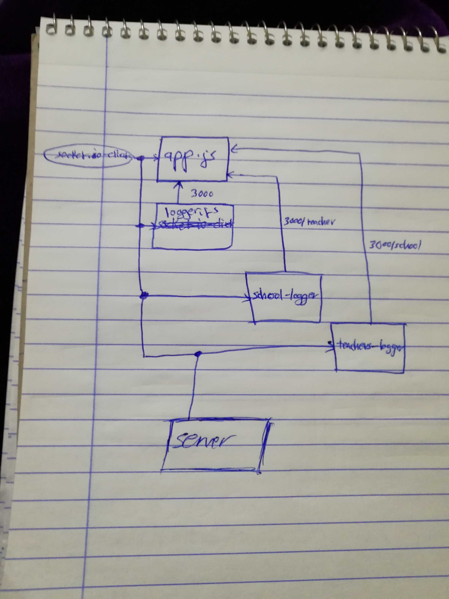

# LAB - Class 18

## Socket.io

### Author: Ayman Alkhawaldeh

### Links and Resources

- [submission PR](https://github.com/ayman-401-advanced-javascript/lab18/pull/1)

#### `.env` requirements
- `PORT` - 3000

#### Worked as a group
  - Ayman J. Al-Khawaldeh
  - Ahmad K. Al-Mahasneh
  - Qusai A. Al-Hanaktah
  - Mohammad S. Al-Hawamdeh

#### UML

